# Watermark Removal unsing Detection, Segmentation and Inpainting

The goal of this mini-project is to design an image restoration pipeline capable of detecting and removing watermarks from images.
The advantage is that only the masked zone is modified, not the whole image.

**Methodology**
1. **Dataset Creation**: Use of the DIV2K dataset [1] (clean, high-resolution images)
2. **Synthetic Data Generation**: Creation of triplets (watermarked image, original image, mask) by randomly overlaying PNG logos and text with variations in opacity, size, and position
3. **Architecture**:
- Detection: Use of Yolo [2] to locate the watermark and guide SAM
-  Segmentation: Use of SAM (Segment Anything Model)[3] to extract the watermark
- Inpainting: Comparison of three approaches (Partial Convolutions UNet + Attention UNet [4][5], Stable Diffusion [6], LaMa [7])

We decided to use PyTorch instead of TensorFlow. In fact, we chose to work with PyTorch on this project in order to broaden our skill set and familiarize ourselves with this tool, which has become indispensable.

## Dataset construction

Drive icons, fonts et model : https://drive.google.com/drive/folders/1MomkLrZw6j06DMKA0jwi3zFR8Qfi4oFQ?usp=sharing

We use the DIV2K dataset [1] as a set of “ground truth” images.

For each image, we randomly select one of two types of content:

- Logos / Icons: Use of PNG files with transparent backgrounds from the drive
- Dynamic Text: Generation of text with:
  - A random font
  - A random color

Once the content is selected, we apply transformations:
- Intensity/Opacity: Adjustment of the alpha channel to make the watermark more or less transparent
- Size: Resizing proportional to the source image

Additionally, we have chosen the placement mode for the additional content:
- Edges: Discreet placement in one of the corners of the image
- Center: Placement in the middle of the image. If the content is text, then we have the option to add a random rotation between -45° and 45°
- Mosaic/Pattern: Repetition of the pattern across the entire image surface with a random rotation  between -45° and 45° for text and icons

Finally, to further complicate the task, we decided to add geometric elements.
- Center: Option to add a cross (X) that crosses the image
- Mosaic: Addition of diagonal lines connecting the elements, creating a grid that fragments the original image

Our data augmentation strategy allows us to diversify our watermarks and ensures better model generalization.

We selected the [DIV2K](https://data.vision.ee.ethz.ch/cvl/DIV2K/) dataset, which provides very high-quality (2K) images so that the model can reconstruct very fine textures. The dataset contains:
- Training: 800 images
- Validation: 100 images
- Test: 100 images (there is no link to download the test dataset)
covering a wide variety of content.

Since there is no validation dataset, we will split the training dataset (90/10) to create a new validation dataset, and use the original validation dataset as the test set.

To maximize the potential of the DIV2K dataset, we have implemented a Random Cropping strategy. Instead of resizing the 2K images, which would result in a loss of detail, we randomly extract 256×256-pixel segments at each iteration. This method acts as data augmentation, allowing the model to see thousands of different textures from the original 800 images.

### Dataset example
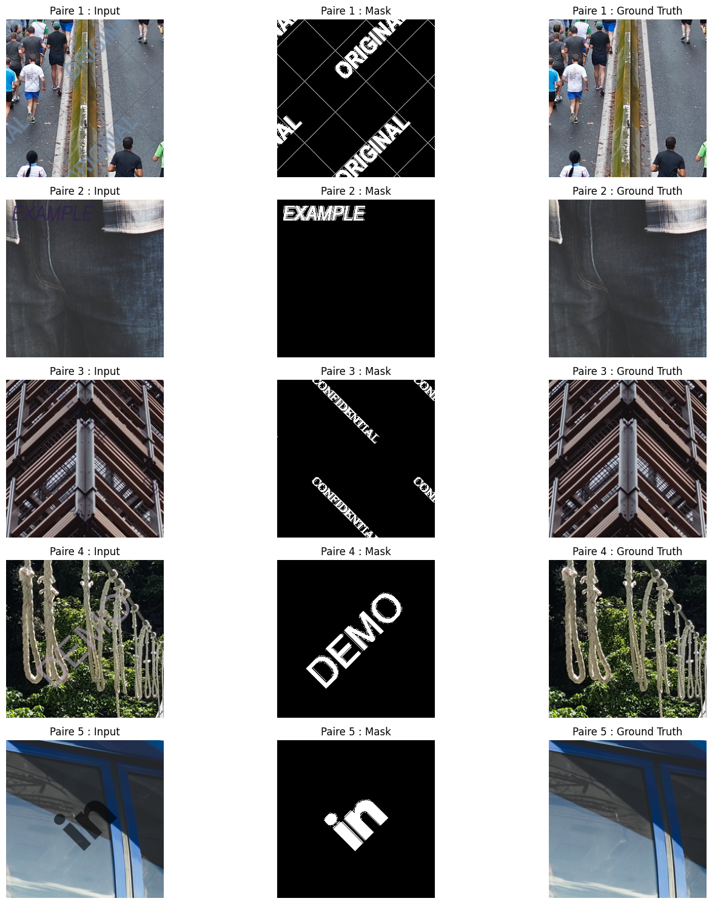

## Training

This project operates using a sequential pipeline divided into three stages:

1. **Detection (YOLO)**: The first stage uses YOLOv8 [2] to locate the watermark and generate a bounding box around it.

2. **Segmentation (SAM)**: Guided by the bounding box, the Segment Anything Model [3] generates a binary mask: white pixels represent the watermark to be removed, and black pixels represent the background to be preserved.

2. **Inpainting**: Once the mask is generated, we tested and compared three different approaches to reconstruct the missing pixels:
   - Partial Convolution U-Net [4] with Attention Gates [5]: This model uses a U-Net architecture where convolutions are “masked.” They ignore corrupted pixels and calculate the reconstruction only from neighboring healthy pixels.
   - Stable Diffusion [6]: This model “imagines” the content. By using the diffusion process, it is capable of recreating complex and highly realistic structures, even if the area to be masked is very large.
   - LaMa (Large Mask Inpainting) [7]: Based on Fast Fourier Convolutions (FFC), this model analyzes the image in the frequency domain. It has a “global” view that allows it to perfectly reconstruct repetitive textures (grass, walls, patterns) where other models produce blurring.

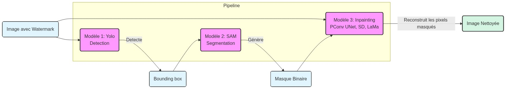

### YOLOv8 for Bounding Box detection

We will use YOLOv8n [2] to first detect the watermark and guide the segmentation with SAM.

We are using the YOLOv8n version because it is a lightweight and fast variant of the architecture. Here are the results.

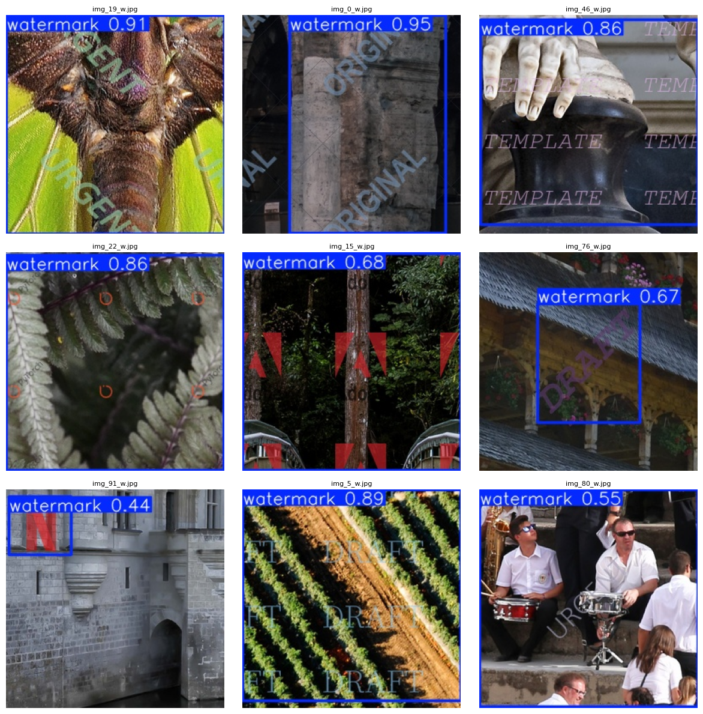

### SAM for Segmentation

Rather than retraining the SAM model [3] from scratch, we fine-tune the existing model. We initialize the SAM model with the ViT-B (Vision Transformer Base) variant. During the training phase, we freeze the weights of the image encoder and the prompt encoder to preserve their feature extraction capabilities. Training thus focuses exclusively on the mask decoder, allowing the model to adapt specifically to watermark segmentation.

**Training Optimization**

Training the SAM model is particularly computationally intensive, as it processes high-resolution images ($1024 \times 1024$). On a standard architecture (e.g. Google Colab T4 with 16GB VRAM), a typical training run almost always results in a `CUDA OutOfMemory` error.

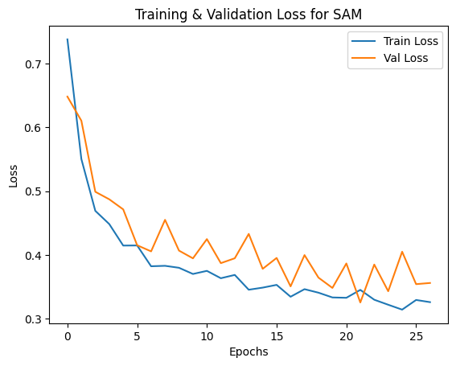

To work around this hardware limitation without degrading model performance, we have implemented two advanced optimization strategies:

**1. Automatic Mixed Precision**

Instead of storing all weights and computations in single precision (Float32, 32 bits), we use mixed precision. The principle is that computationally intensive operations (convolutions, matrix multiplications) are performed in Float16 (16 bits), while sensitive variables requiring high precision remain in Float32. This halves the memory footprint of activations and speeds up computations, while maintaining training stability thanks to a Gradient Scaler that prevents gradient underflow.

**2. Gradient Accumulation**

To stabilize training, a high `batch_size` (e.g. 8 or 16) is recommended. However, VRAM limits us to loading only one image at a time (`batch_size=1`). To compensate, we simulate a larger “virtual batch”. Instead of updating the network weights for each image, we accumulate the gradients over several steps (e.g. 16 steps). Mathematically, we have : 
    $$\theta_{t+1} = \theta_t - \eta \cdot \sum_{i=0}^{N} \nabla L(x_i)$$
    Where $N$ is the number of accumulation steps.
This is equivalent to training with a `batch_size` of 16, but with the memory footprint of a `batch_size` of 1.

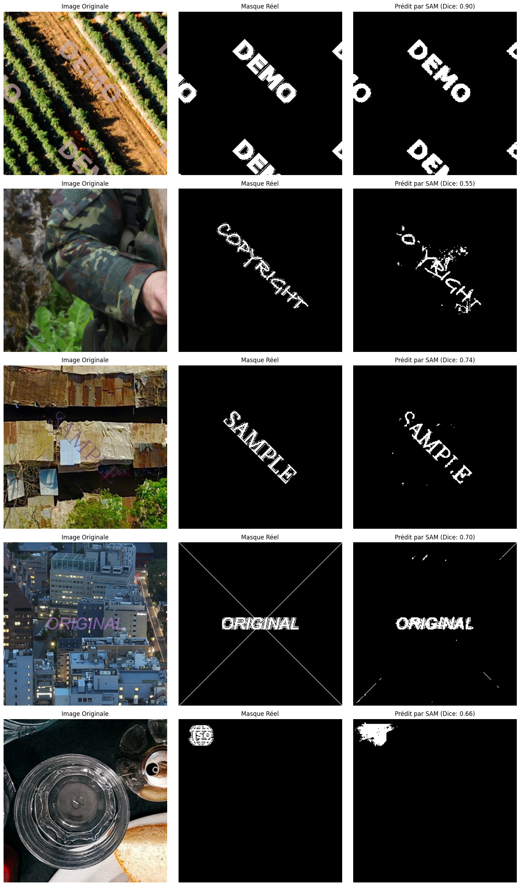

Although the Dice score of approximately 0.7 may seem modest at first glance for a segmentation task, upon visual inspection, it becomes clear that the “non-detection” areas almost always correspond to segments where the contrast between the watermark and the image is extremely low.

In these specific configurations, the watermark has a luminance and colorimetry that are virtually identical to those of the background, making it nearly invisible to the naked eye. Consequently, this is less detrimental to the final reconstruction step: if the model does not segment these areas, it is because the artifact already blends in naturally there.

### U-Net for inpainting

This model is an optimized variant of the U-Net architecture, specifically designed for inpainting. It combines three key technologies: a pre-trained encoder, partial convolutions, and attention mechanisms.

#### Partial Convolution [4]

Unlike standard convolutions, which process all pixels (even those in the watermark) in the same way, Partial Convolution:

* It ignores invalid pixels using the SAM mask to calculate new values only from valid pixels.
* It do dynamic normalization adjusting the brightness based on the ratio of valid pixels present in the filter’s neighborhood.
* With each pass, it gradually reduces the watermark area by “nibbling” at the edges, allowing the network to reconstruct the image layer by layer.

#### Encoder: ResNet-34

To help the model understand the image context, we use a ResNet-34 encoder pre-trained on ImageNet.

#### Attention Mechanism

We enhanced the original architecture by drawing inspiration from U-Net Attention [5]. Attention Gates have been placed at the Skip Connections to act as smart filters. They use the signal from the deep layers to guide the information coming from the encoder. This prevents the watermark textures present in the encoder from “leaking” into the decoder, allowing only features useful for background reconstruction to pass through.

#### Processing and Merge Pipeline

1. The model receives the degraded image and the binary mask (0 = clean, 1 = watermark).
2. The image is “cleaned” (`x * (1-mask)`) to ensure that no watermark pixels contaminate the initial computation layers.
3. The decoder, via the `PConvBlock` blocks, infers the missing pixels based on the surrounding context.
4. A final merge ensures that areas that were not masked remain exactly identical to the original, with no loss of quality, while only the watermark area is replaced by the model’s prediction.

Inspiration for the implementation: [PConv Github](https://github.com/NVIDIA/partialconv/tree/master) 

Unlike the original paper [4], in which training using batch normalization takes several days and requires a complex two-step parameter freezing process, we opted for instance normalization. This choice simplifies the training process by stabilizing the statistics frame by frame despite the masked areas, which offers a better balance between computation time and reconstruction quality for this mini-project.

#### Loss

To train the PConv U-Net model, we implemented a loss function using the optimized weights recommended in the original research paper [4]. This combination includes reconstruction (L1), perceptual, and style losses, as well as a penalty for texture consistency, to ensure a seamless transition between the reconstructed areas and the original pixels.

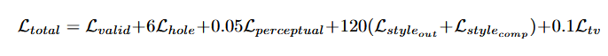

#### Results and tests

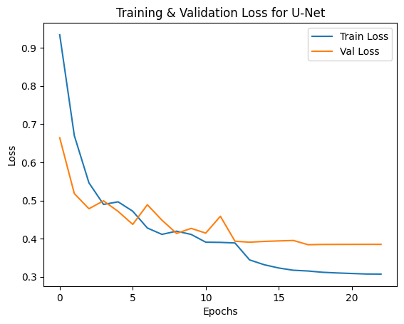

The following metrics are used for the test:
- The PSNR, which measures the image's digital fidelity. It quantifies the difference in value between the pixels in the original (unprocessed) image and those in the generated (denoised) image.
- The SSIM, which analyzes blocks of pixels to evaluate: luminance, contrast, and structure.

### Stable Diffusion for inpainting

The StableDiffusionInpainting model is a specific variant of Stable Diffusion designed to modify specific parts of an image while preserving the rest. Unlike the standard model, which generates an image from scratch, the inpainting pipeline takes three main inputs:

*   The original image
*   Themask, which is black-and-white image indicating where the model should intervene (white represents the area to be modified).
*   The prompt, which is the description of what should appear in the masked area.

The model uses an additional input channel for the mask. It analyzes the pixels at the edges of the masked area to create a smooth and consistent transition in terms of lighting, texture, style, etc.

We also use LoRAs, which are micro-models applied on top of the base model. They are used to specialize the model for a specific concept without having to retrain the entire network. In inpainting, they allow us to inject a specific style, a character, or a highly detailed object into the masked area. You can adjust the “weight” of a LoRA to control its influence on the generation.

The most critical parameter is the denoising strength:
*   Close to 0: The model changes almost nothing.
*   Close to 0.5: Balanced modification; preserves the original overall shape but changes the content.
*   Close to 1: The model completely ignores what was under the mask and creates something new 

For more information,
*   LoRA paper: https://arxiv.org/pdf/2106.09685
*   Example of LoRA usage: https://www.stablediffusion.blog/lora-stablediffusion

#### Training

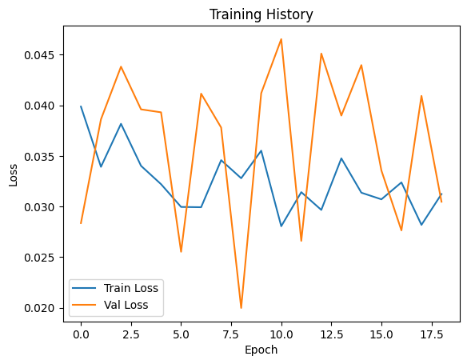

#### Test

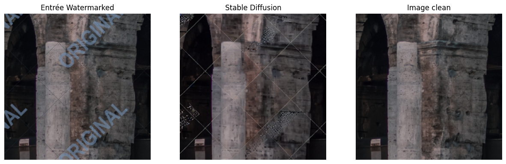
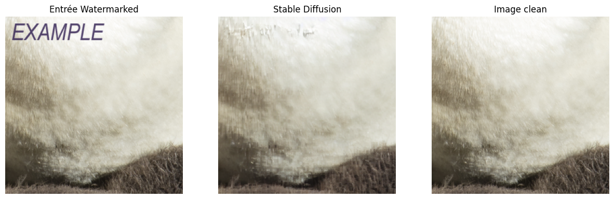
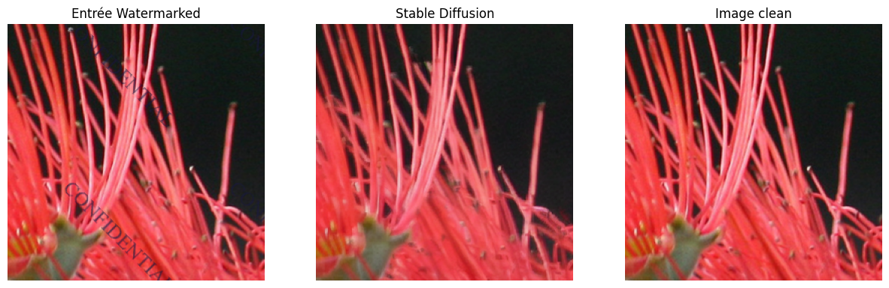
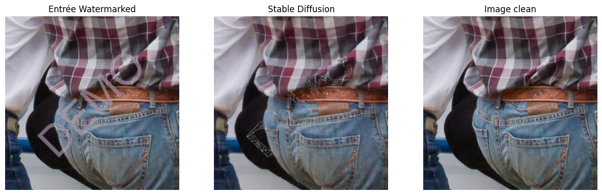
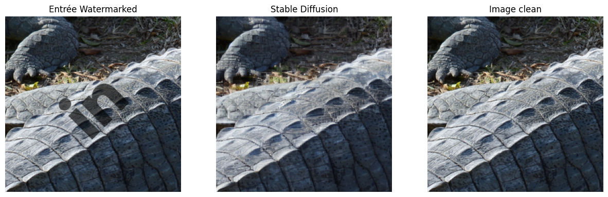

### LaMa

LaMa [7] is one of the most robust models in the current state of the art. LaMa’s strength lies in its use of Fast Fourier Convolutions, which, unlike classical convolutions, analyze the image in the frequency domain to obtain an immediate global receptive field.

Given its excellent generalization ability, we chose not to perform fine-tuning for our specific task. The results obtained in zero-shot mode are already of very high quality.

This comparison allows us to assess whether our specialized architecture can match the texture consistency and reconstruction fidelity of this benchmark model.

#### Tests

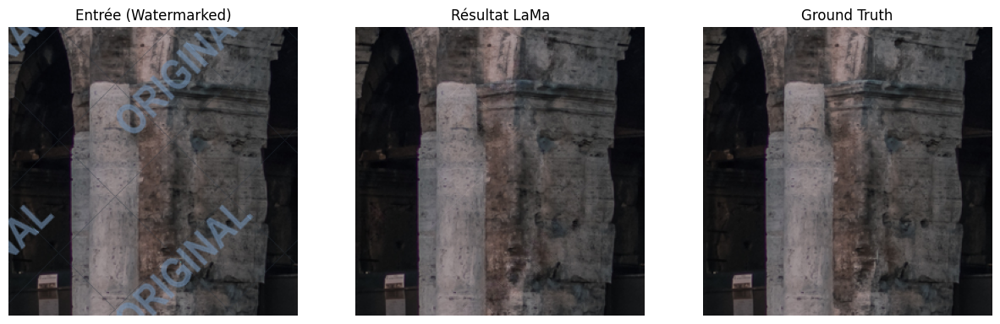
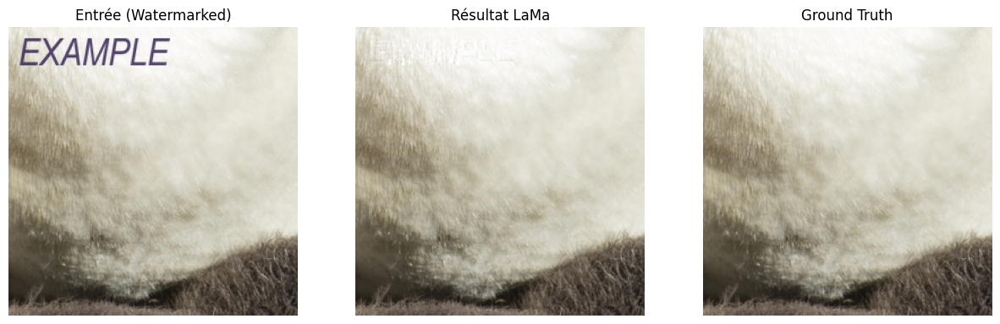   

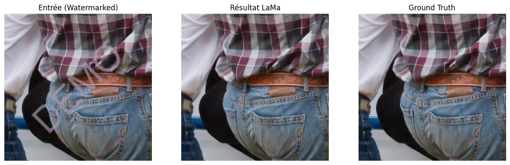
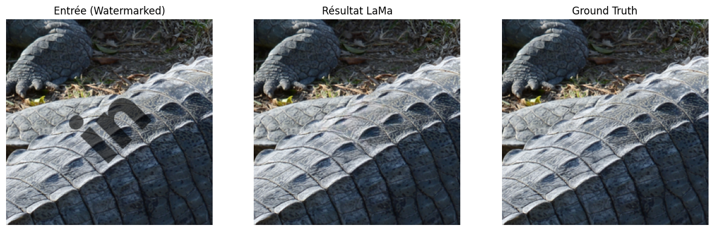

## Full Inference Pipeline

Full inference pipeline on one example.

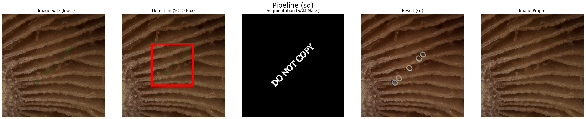

Other examples (the full inference has more difficulties because it chain 3 different models trained on Google COLAB free GPU)

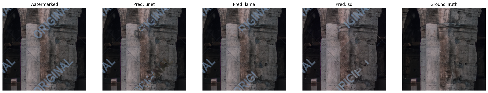
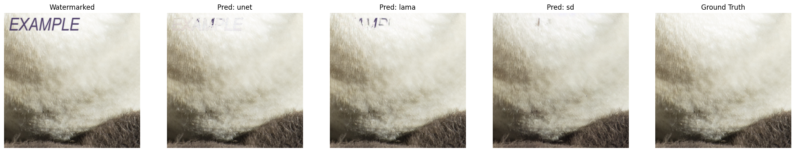
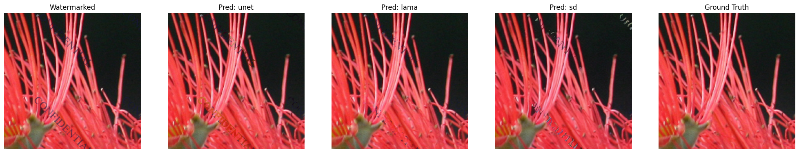
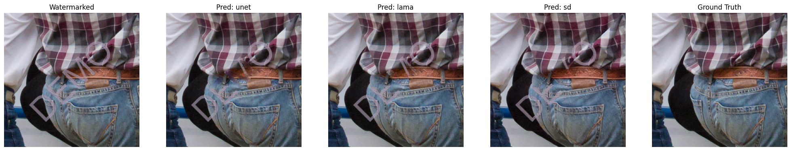
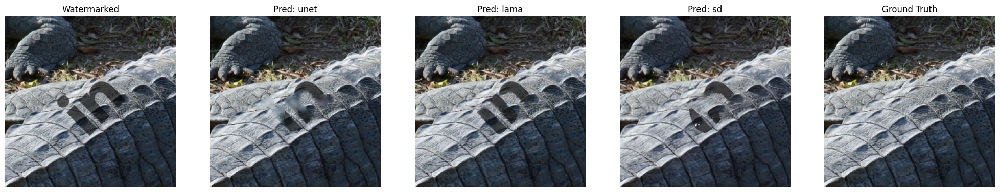

## References

[[1] DIV2K Dataset](https://data.vision.ee.ethz.ch/cvl/DIV2K/) E. Agustsson and R. Timofte, "NTIRE 2017 Challenge on Single Image Super-Resolution: Dataset and Study," The IEEE Conference on Computer Vision and Pattern Recognition (CVPR) Workshops, July 2017.

[[2] YOLOv8](https://arxiv.org/abs/2305.09972) R. Varghese and S. M., "YOLOv8: A Novel Object Detection Algorithm with Enhanced Performance and Robustness," 2024 International Conference on Advances in Data Engineering and Intelligent Computing Systems (ADICS), Chennai, India, 2024, pp. 1-6. doi: 10.1109/ADICS58448.2024.10533619.

[[3] Segment Anything Model (SAM)](https://arxiv.org/abs/2304.02643) A. Kirillov, E. Mintun, N. Ravi, H. Mao, C. Rolland, L. Gustafson, T. Xiao, S. Whitehead, A. C. Berg, W. Lo, P. Dollár, and R. Girshick, "Segment Anything," arXiv:2304.02643, 2023.

[[4] Partial Convolution U-Net](https://arxiv.org/abs/1804.07723) G. Liu, F. A. Reda, K. J. Shih, T. Wang, A. Tao, and B. Catanzaro, "Image Inpainting for Irregular Holes Using Partial Convolutions," The European Conference on Computer Vision (ECCV), 2018.

[[5] Attention U-Net](https://arxiv.org/abs/1804.03999) O. Oktay, J. Schlemper, L. Le Folgoc, M. Lee, M. Heinrich, K. Misawa, K. Mori, S. McDonagh, N. Y. Hammerla, B. Kainz, B. Glocker, and D. Rueckert, "Attention U-Net: Learning Where to Look for the Pancreas," arXiv:1804.03999, 2018.

[[6] Stable Diffusion](https://arxiv.org/abs/2112.10752) R. Rombach, A. Blattmann, D. Lorenz, P. Esser, and B. Ommer, "High-Resolution Image Synthesis with Latent Diffusion Models," arXiv:2112.10752, 2021.

[[7] LaMa (Large Mask Inpainting)](https://arxiv.org/abs/2109.07161) R. Suvorov, E. Logacheva, A. Mashikhin, A. Remizova, A. Ashukha, A. Silvestrov, N. Kong, H. Goka, K. Park, and V. Lempitsky, "Resolution-robust Large Mask Inpainting with Fourier Convolutions," arXiv preprint arXiv:2109.07161, 2021.
